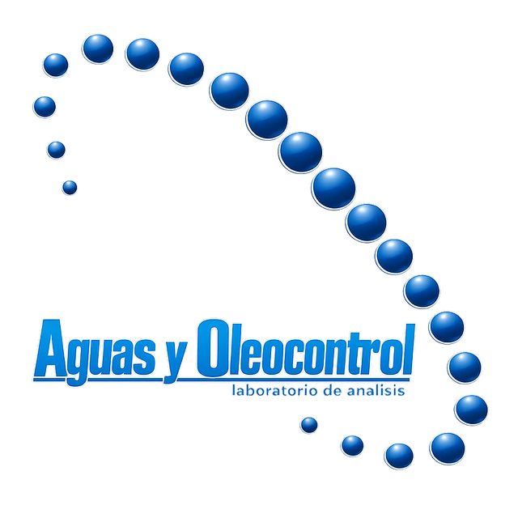
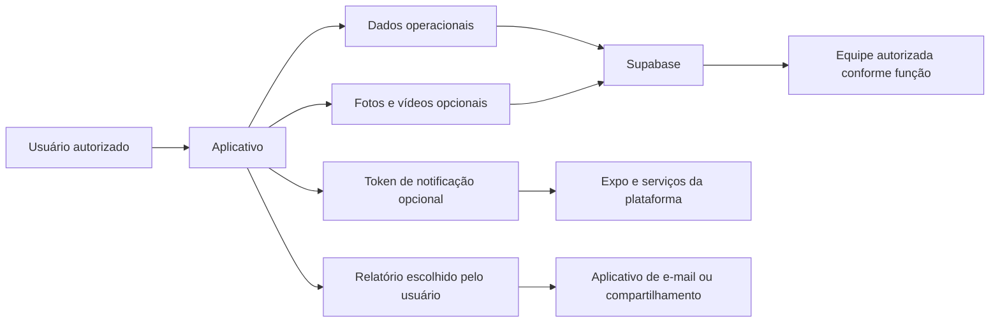

<div align="center">


# Política de Privacidade — Aguas y Oleocontrol



**Documento público que explica, em espanhol, como o aplicativo profissional de gestão de piscinas utiliza e protege informações.**

[](https://xx7rg.github.io/aguas-y-oleocontrol-privacy/)
[](https://github.com/xx7rg/aguas-y-oleocontrol-privacy/actions/workflows/validate.yml)
[](index.html)
[](index.html)

</div>

## Documento publicado

**Política online:** [xx7rg.github.io/aguas-y-oleocontrol-privacy](https://xx7rg.github.io/aguas-y-oleocontrol-privacy/)

A página apresenta as categorias de dados, finalidades, permissões do dispositivo, fornecedores, conservação, segurança e meios para exercer direitos. O conteúdo foi comparado com as funções implementadas no aplicativo **Aguas y Oleocontrol**.

## O que a política cobre

| Área | Informação documentada |
| --- | --- |
| Conta | nome, usuário, e-mail, função e permissões |
| Operação | piscinas, endereços informados, visitas, medições, tarefas e incidentes |
| Mídia | fotografias, vídeos e áudio presente em gravações de vídeo |
| Notificações | token de push, plataforma e estado de entrega |
| Segurança | sessões, auditoria, sincronização e cache temporário |
| Direitos | acesso, correção, exclusão, oposição, limitação e portabilidade, quando aplicáveis |

## Fluxo das informações



## Decisões de privacidade documentadas

- o aplicativo não solicita localização GPS precisa;
- câmera, galeria, microfone e notificações dependem da permissão do usuário;
- fotografias e vídeos são usados como documentação operacional;
- não há venda de dados nem uso para publicidade comportamental declarado;
- Supabase, Expo, Apple e Google são identificados conforme sua função;
- solicitações podem ser enviadas para `contato.rgsantos@gmail.com`.

## Estrutura

```text
aguas-y-oleocontrol-privacy/
├── assets/
│   ├── aguas-y-oleocontrol.png
│   └── x7rg-enterprise.png
├── index.html
├── politica_privacidad_aguas_y_oleocontrol_es.html
├── scripts/
│   └── validate_static.py
└── README.md
```

O arquivo `index.html` é a versão vigente. O endereço antigo é mantido para compatibilidade com links já distribuídos.

## Visualizar localmente

Requisito: Python 3.

```bash
git clone https://github.com/xx7rg/aguas-y-oleocontrol-privacy.git
cd aguas-y-oleocontrol-privacy
python -m http.server 8000 --bind 127.0.0.1
```

Abra [http://127.0.0.1:8000](http://127.0.0.1:8000) e encerre o servidor com `Ctrl+C`.

### Validar arquivos e links locais

```bash
python scripts/validate_static.py
```

## Publicação

O workflow `Deploy GitHub Pages` valida e publica os arquivos estáticos após cada envio para a branch `main`. Para atualizar o documento, altere `index.html`, execute a validação local e envie a mudança ao repositório.

## Manutenção do conteúdo

A política deve ser revista sempre que o aplicativo passar a coletar outra categoria de dados, solicitar nova permissão, integrar um novo fornecedor ou alterar o processo de exclusão. O texto público deve continuar refletindo o comportamento efetivo do aplicativo.

---

<div align="center">

© 2026 **x7rG ENTERPRISE™** — Todos os direitos reservados.

[](https://www.linkedin.com/in/rgds)
&nbsp;
[](https://www.instagram.com/_7ragnar/)

</div>
